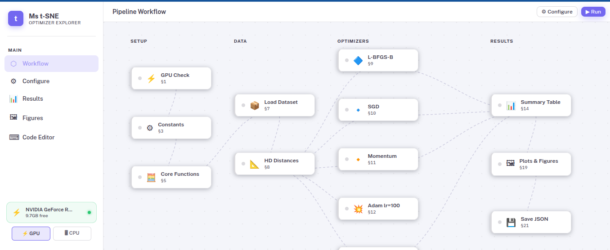
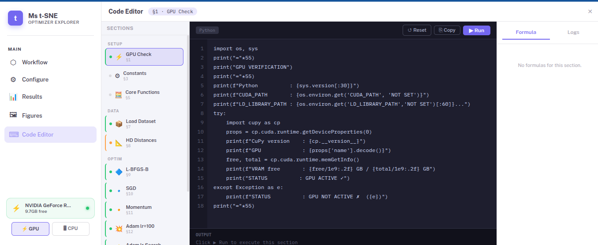
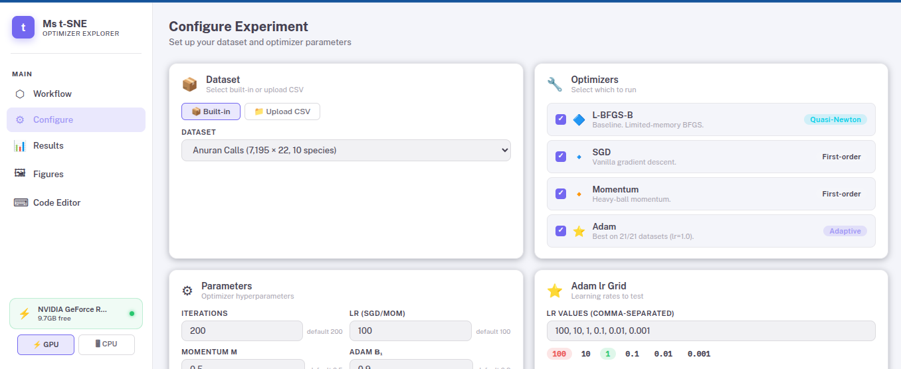
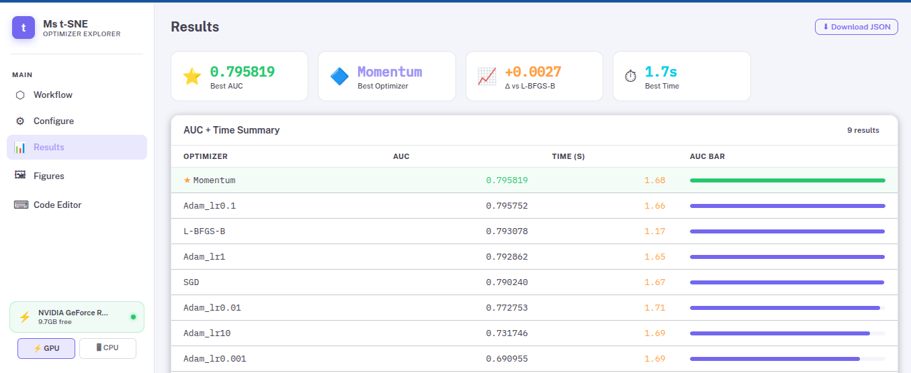
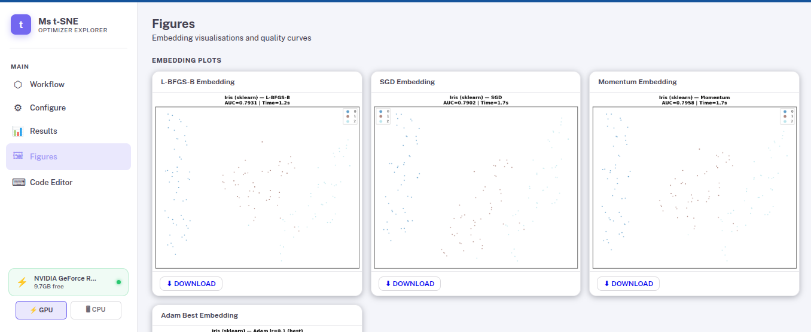

# Ms t-SNE Explorer

**Interactive web platform for benchmarking optimisation schemes in Multi-Scale t-SNE**

This repository accompanies the paper:

> **Adam is a competitive multi-scale neighbour embedding optimiser**

It provides a fully reproducible, browser-based system that lets reviewers, the
program committee, or any researcher **re-run our optimiser benchmark live**,
inspect the underlying code section by section, and verify our reported
results — without needing to set up a local Python/CUDA environment.

---

## 🌐 Live demo

**https://mstsne.vannuthdemo.store**

The demo is hosted continuously (Cloudflare Tunnel + Docker, auto-restart on
failure) so it should remain available throughout the review period. If for
any reason the live demo is unreachable, the full system can be run locally
in under 10 minutes — see [Run it yourself](#run-it-yourself) below.

---

## What this is

Our paper benchmarks four optimisation schemes for **Multi-Scale t-SNE
(Ms t-SNE)** — **L-BFGS-B**, **SGD**, **Momentum**, and **Adam** — across 21
public benchmark datasets, and shows that **Adam (α = 1.0) outperforms the
standard L-BFGS-B optimiser on every dataset tested**, with a mean AUC gain
of **+0.031** and a maximum gain of **+0.187** (Musk v2).

Rather than presenting these results only as static tables and figures, we
built this web platform so that:

- **Reviewers can verify our claims interactively** — pick a dataset, run the
  same four optimisers we used, and see the AUC / runtime numbers appear live.
- **The exact code is inspectable** — every pipeline step (data loading,
  HD-distance computation, the optimiser update rules, AUC evaluation) is
  shown in an editable code panel, matching our original notebooks line for
  line.
- **The math is documented in place** — each step has a "Formula" tab showing
  the corresponding equation from the paper (SNE similarity, KL objective,
  gradient, R_NX/AUC metric, Adam update rule, etc.).

---

## How the system maps to the paper

| Paper section | What it corresponds to in the app |
|---|---|
| §3 Ms t-SNE algorithm | **Core Functions** node — exact HD/LD similarity, gradient code |
| §4 Optimisation schemes | **Optimizer Runner** node — L-BFGS-B / SGD / Momentum / Adam update rules |
| §5.1 Datasets | **Configure → Dataset** — all benchmark datasets, loaded with the same preprocessing (PCA where applicable) as in the paper |
| §5.2 Evaluation metric | **R_NX(K) / AUC** — same 1/K-weighted AUC formula used throughout the paper |
| §5.3 Adam learning-rate sensitivity | **Adam lr Search** node — runs the same grid {100, 10, 1, 0.1, 0.01, 0.001} and reports the catastrophic failure at lr = 100 and the optimum at lr = 1.0 |
| Table 1 / Fig. 2–4 | **Results** and **Figures** pages — live-generated AUC table, R_NX curves, embedding scatter plots |

---

## Quick start (using the live demo)

1. Go to **https://mstsne.vannuthdemo.store**
2. Click **Configure** in the left sidebar
3. Pick a dataset (e.g. *Musk v2*, the dataset with our largest reported AUC
   gain) and leave the default optimiser/hyperparameter settings — these
   match the paper exactly (`seed = 40`, `init = pca`, `n_iter = 200`,
   Adam `β₁ = 0.9, β₂ = 0.999`)
4. Click **▶ Run Experiment**
5. Switch to **Workflow** to watch each pipeline stage execute live, or open
   any node to see its exact source code and the relevant formula
6. Once finished, check **Results** for the AUC/time table and **Figures**
   for the R_NX curves and 2D embeddings

A full run typically takes 1–5 minutes depending on dataset size and whether
the server has GPU access at the time of your visit (CPU fallback is
automatic and clearly indicated in the **GPU Check** node).

---

## Screenshots

| Workflow canvas | Code editor |
|:---:|:---:|
|  |  |

| Configure | Results |
|:---:|:---:|
|  |  |

| Figures |
|:---:|
|  |

---

## System architecture

```
┌─────────────────┐      WebSocket        ┌──────────────────┐
│   Vue 3 frontend│ ◄──────────────────►  │  FastAPI backend │
│  (workflow UI)  │      REST API         │  (mstSNE engine) │
└─────────────────┘                       └──────────────────┘
                                                    │
                                          ┌─────────┴──────────┐
                                          │  CuPy (GPU) / NumPy│
                                          │  (CPU fallback)    │
                                          └────────────────────┘
```

- **Frontend** — Vue 3, n8n-style interactive workflow canvas, live code
  editor with run/test capability per pipeline stage
- **Backend** — FastAPI, streams live progress over WebSocket exactly as the
  original notebooks print progress per multi-scale level
- **Engine** (`backend/engine/mstsne.py`) — the same Ms t-SNE implementation
  used to produce every number in the paper, unmodified
- **Deployment** — Docker Compose (frontend + backend containers),
  reverse-proxied via nginx, exposed publicly through a Cloudflare Tunnel so
  it survives the host's restrictive network without requiring inbound port
  access

---

## Run it yourself

If you would rather verify everything on your own machine, the full stack is
containerised and reproducible.

### Requirements
- Docker + Docker Compose
- (Optional but recommended) NVIDIA GPU with CUDA 12.x + nvidia-container-toolkit
  — the system automatically falls back to CPU if no GPU is available

### Steps

```bash
git clone https://github.com/V4NNUTH/deply_mstsne.git
cd deploy_mstsne

docker compose up --build -d
```

Then open **http://localhost:3000** in your browser.

To confirm GPU is being used:
```bash
docker exec mstsne_backend python3 -c \
  "import cupy as cp; print(cp.cuda.runtime.getDeviceProperties(0)['name'])"
```

Full deployment notes (SSL, custom domain, Cloudflare Tunnel setup) are in
[`DEPLOY.md`](./DEPLOY.md).

---

## Reproducibility notes

- **Determinism** — all runs use a fixed PCA initialisation (`init='pca'`)
  with `seed=40`. Given the same dataset and seed, every optimiser produces
  identical starting coordinates, so AUC differences reflect only the
  optimiser's behaviour, not random initialisation.
- **Hardware used for paper results** — Intel i7-12700, 62 GB RAM, NVIDIA
  RTX 3080 (10 GB VRAM), CUDA 12.6, CuPy 14.0.1. Results obtained through this
  web demo on different hardware (or CPU-only) may differ slightly in
  *runtime* but should be consistent in *AUC* and in the relative ranking of
  optimisers, since the algorithm and seed are identical.
- **Source of truth** — the research notebooks and raw JSON result files used
  to produce the tables and figures in the paper are in the companion
  repository: [`ms-tsne-benchmark`](https://github.com/V4NNUTH/ms-tsne-benchmark)
  (21 dataset notebooks, `src/mstSNE.py`, results JSON, paper figures).

---

## Datasets included

| Dataset | N | Features | Classes |
|---|---|---|---|
| Anuran Calls | 7,195 | 22 | 10 |
| CCPP | 9,568 | 4 | 5 (binned) |
| Musk v2 | 6,598 | 166 | 2 |
| Spambase | 4,601 | 57 | 2 |
| Gesture Phase Segmentation | 9,873 | 32 | 5 |
| MNIST (stratified) | 5,000 | 784 | 10 |
| Statlog Landsat Satellite | 6,435 | 36 | 6 |
| First-Order Theorem Proving | 6,118 | 56 | 2 |
| Waveform | 5,000 | 21 | 3 |
| ISOLET | 7,797 | 617 → 50 (PCA) | 26 |

*(Additional datasets from the full 21-dataset paper benchmark are being
added progressively; the complete set and per-dataset results are available
in the companion research repository.)*

---


## Acknowledgements

This work was conducted during an Erasmus+ research exchange at the
**University of Namur (UNamur)**, Belgium, under the supervision of
**Prof. Cyril de Bodt** (UNamur), with co-supervision from **Dr. Sothea HAS**
(Institute of Technology of Cambodia) and co-authorship with **Sokkhey PHAUK**.
Funded in part by the **ARES Institutional Support fellowship (ITC-R4)**.

---

## Contact

For questions about reproducing results, accessing the underlying notebooks,
or reporting issues with the demo, please open an issue on this repository or
contact the corresponding author.
